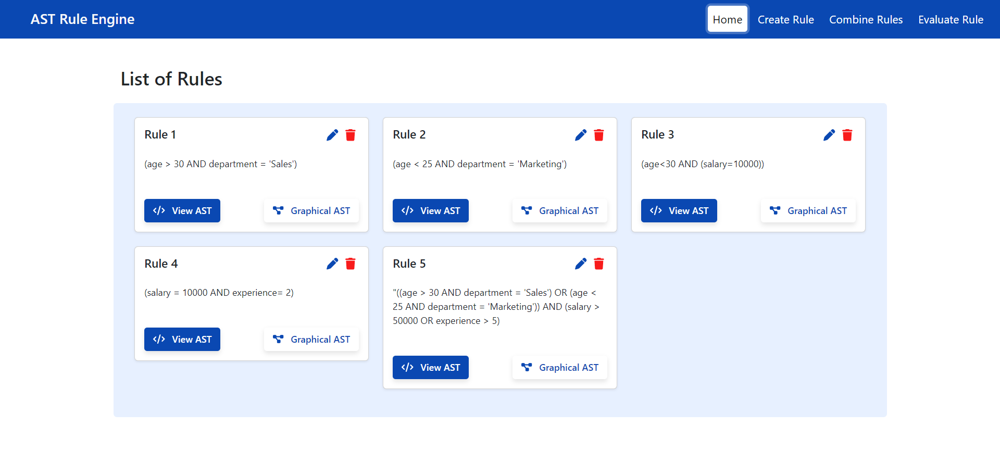
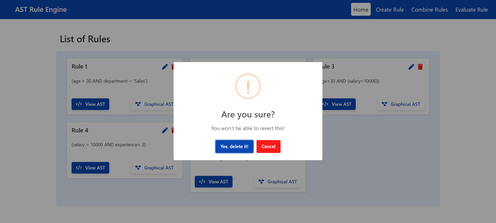
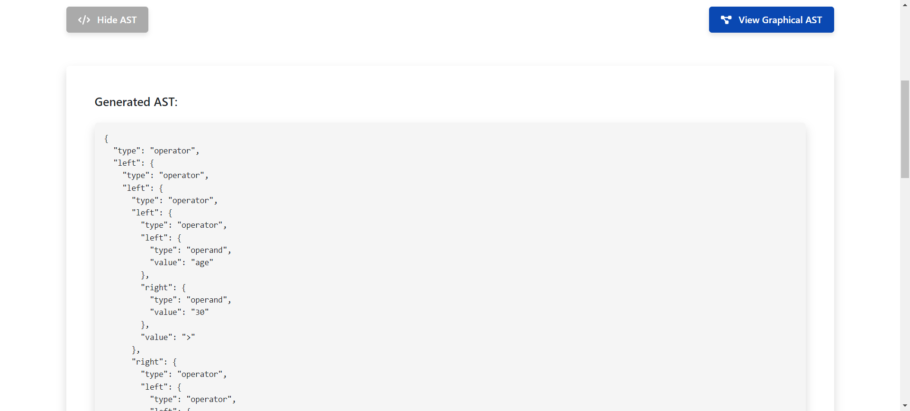
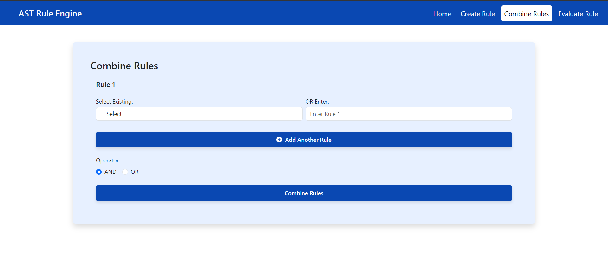
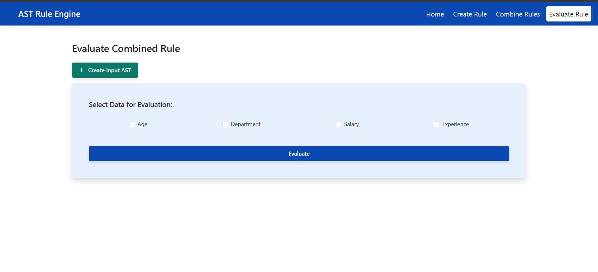
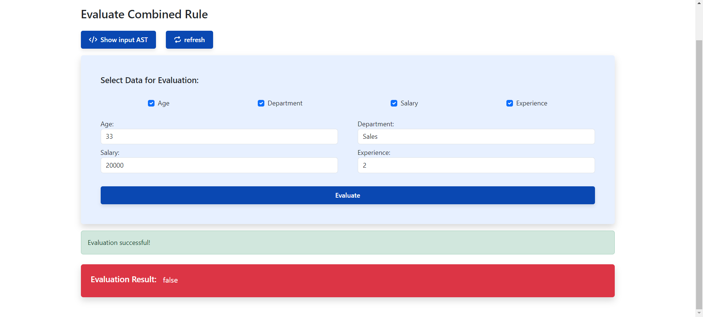

# AST Rule Engine Frontend

This is the frontend for the Rule Engine application. It is built using Next.js and interacts with the backend service to create, combine, and evaluate rules.

## Table of Contents
- [Prerequisites](#prerequisites)
- [Installation and Running the Application](#installation)
- [Project Description](#project-description)
- [UI Walkthrough](#ui-walkthrough)
- [Technologies Used](#technologies-used)

---

## Prerequisites

Before you begin, ensure you have met the following requirements:

- **Node.js**: You need to have Node.js installed on your machine. You can download it from [Node.js official website](https://nodejs.org/).
- **npm**: npm (Node Package Manager) is usually included with Node.js. You can verify the installation by running:
  ```bash
  npm -v
  ```

## Installation

### 1. Clone the repository
```bash
git clone https://github.com/your-username/ast-rule-engine-frontend.git
cd ast-rule-engine-frontend
```

### 2. Install Dependencies
```bash
npm install
```

### 3. Run the Application
```bash
npm run dev
```

## Project Description

This project is a simple 3-tier Rule Engine application that allows users to define and evaluate conditional rules based on attributes like age, department, salary, etc. The system uses an Abstract Syntax Tree (AST) to represent these rules. The frontend allows users to:

- Create individual rules.
- Combine multiple rules into a complex rule.
- Evaluate a rule against a dataset input given by the user.

---

## UI Walkthrough

### 1. Home Page

The home page contains a nav bar with tabs to navigate to create, combine, and evaluate rules. It displays all the existing rules stored by the user in the database. It also provides functionality to edit and delete the existing rules.

| Home Page | Edit Rule |
|-----------|-----------|
|  |  |

| Delete Rule |
|-------------|
|  |

### 2. Create Rule

In the "Create Rule" section, users can input a rule string (e.g., `(age > 30 AND department = 'Sales')`) to generate a corresponding AST and store them in the database. These ASTs can be viewed in both graphical and JSON format.

| Create Rule | Create Rule Output |
|-------------|---------------------|
|  |  |

| AST JSON | Graphical AST |
|----------|---------------|
|  |  |

### 3. Combine Rules

Users can select multiple rules to combine into a single AST, optimizing for efficiency. This page can be navigated from evaluate rules when we need to provide input AST. We can also directly go to this page and try any combinations of rules just for checking.

| Combine Rules | Combine Rules 2 |
|---------------|-----------------|
|  |  |

### 4. Evaluate Rule

In the "Evaluate Rule" section, users can input attributes (e.g., `age`, `salary`) and evaluate a rule based on this dataset.

| Evaluate Rule | Evaluate Rule True |
|---------------|---------------------|
|  |  |

| Evaluate Rule False |
|---------------------|
|  |

---

## Technologies Used

- **Next.js** - A React framework for building server-side rendered applications.
- **Axios** - Promise-based HTTP client for interacting with the backend.
- **React** - A JavaScript library for building user interfaces.
- **Bootstrap** - For UI styling and responsive design.